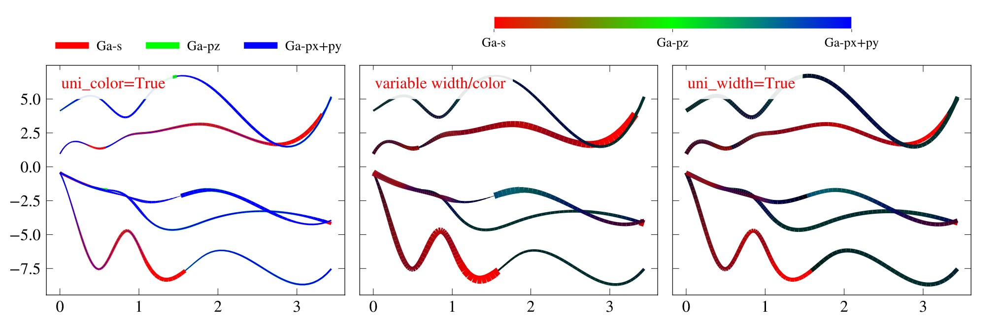
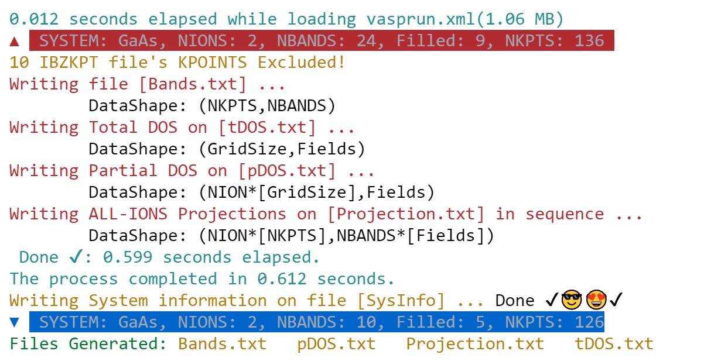
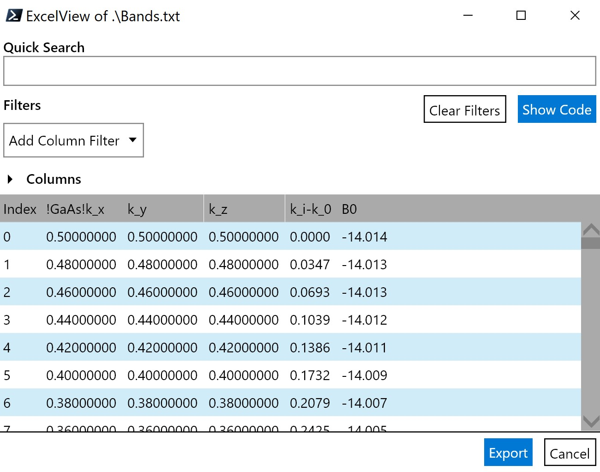
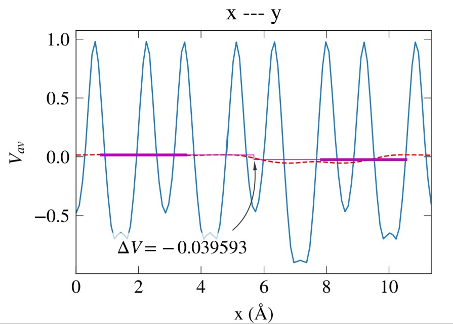
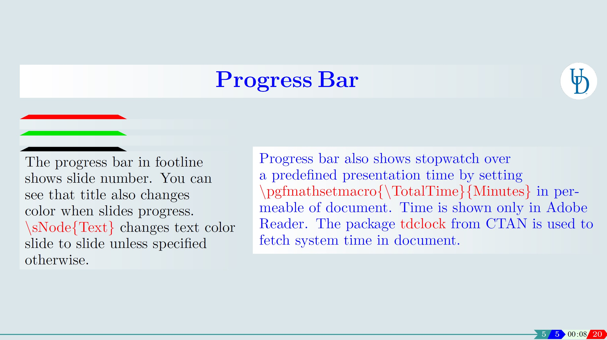

# Vasp2Visual
> A Pre/Post processing PowerShell Module for Vasp output. Scripts allow user take full control of their vasp output data. You can plot on your own by just getting data in column format through using the command `Export-VaspRun` in a folder containing `vasprun.xml`. The plot file is generated after running `Get-Plot` is editable per your choice,although the plot you get is publication ready. 
- You are strongly recommended to download [STIX Fonts](https://www.stixfonts.org/) to make your plot fonts similar to article's fonts. 
- You need to install various python module including numpy, matplotlib and for interactive plots, you need to install [Plotly](https://plot.ly/python/getting-started/). 
- The few of available commands include the following.
```powershell
PS> Get-Command -Module Vasp2Visual
```
```
CommandType     Name                                               Version    Source
-----------     ----                                               -------    ------
Function        Enable-SelectiveDynamics                           1.0.0.0    Vasp2Visual
Function        Export-LOCPOT                                      1.0.0.0    Vasp2Visual
Function        Export-VaspRun                                     1.0.0.0    Vasp2Visual
Function        Export-VR2                                         1.0.0.0    Vasp2Visual
Function        Find-GapOfBands                                    1.0.0.0    Vasp2Visual
Function        Get-AlignedPotential                               1.0.0.0    Vasp2Visual
Function        Get-DensityPlot                                    1.0.0.0    Vasp2Visual
Function        Get-InteractivePlot                                1.0.0.0    Vasp2Visual
Function        Get-KPath                                          1.0.0.0    Vasp2Visual
Function        Get-Plot                                           1.0.0.0    Vasp2Visual
Function        Get-Args                                           1.0.0.0    Vasp2Visual
Function        Merge-ToSlab                                       1.0.0.0    Vasp2Visual
Function        New-Presentation                                   1.0.0.0    Vasp2Visual
```

----------
## Version2 is Here!
> Version2 provides extra 16 commands like `Export-VR2 -switches` which accepts path to vasprun file and returns the files irrespetive you have ISPIN 1 or 2. It creates data in both cases automatically which you can use for plotting (currently spin-polarized plots not available, but you have data to make your own). 
- A separate python module [pivotpy](https://massgh.github.io/pivotpy/) is under developement. The difference between powershell and python versions is data files and objects in memory respectively.
- Powershell wrapper commands for `pivotpy` will be available soon! Have an early look at this 
> .
```powershell
PS> Export-VR2 -InputFile .\vasprun.xml -SkipK 10 -MaxFilled 5 -MaxEmpty 5
```
> 
```powershell
PS> $x=Read-BigFile -AbsPath E:\Research\Current\pDOS.txt -StopIndex 5
PS> Write-BigStream -StreamArray $x -AbsFilePath E:\Research\Current\new.txt -AsOneLine
```

- Note: Both `Read-BigFile` and `Write-BigStream` requires full file path to work properly. These functions are useful to parse big files like LOCPOT which otherwise are timely expensive.

----------
## Get-IntoYourWorkStation
- Launch your Powershell console and run `Set-ExecutionPolicy Unrestricted`. This will allow you to run scripts.
### Direct Install (Not recommended, its behind github)
- For direct install from Powerhell Gallery, follow link [Vasp2Visual@PSGallery](https://www.powershellgallery.com/packages/Vasp2Visual/1.0.3.0) and follow guidlines or run the command below in the console
```powershell
Install-Module Vasp2Visual
#Click Y for what prompts in console.
```
### Download from Github (Recommended for latest updates)
- Find the path to Powershell Module by running `$env:PSModulePath` command and then download the directory [Vasp2Visual](Vasp2Visual) in that path. There are usually three paths.
```powershell
PS> $env:PSModulePath
```
```
C:\Users\mass_\Documents\WindowsPowerShell\Modules;
C:\Program Files\WindowsPowerShell\Modules;
C:\WINDOWS\system32\WindowsPowerShell\v1.0\Modules
```
### After Installation Steps
- Running `Import-Module Vasp2Visual` in Powershell console will make all commands in this module available to use. If you want to make it permanent, include this import command in your powershell profile by typying `your_editor $PROFILE`.
- Now run `Get-Module` command. This will show you that Vasp2Visual is ready and you can see list of commands.
- You need vasprun.xml file to collect data. It is recommended that if you have `vasprun.xml` file from DOS calculations,put that file in a folder named `dos` or `DOS` in the root folder where vasprun.xml is present from a bandstructure calculation and `run plotting commands only in root folder` but run `Export-VaspRun` in each folder in case of BandDOS composite plots.

----------
## Get-FunctionsWork

To import Vasp2Visual and see if it is available in current session, run
```powershell
PS> Import-Module Vasp2Visual
PS> Get-Module  #will give all imported modules including the one you just imported
```
```
Script     1.0.0.0    Vasp2Visual                         {Close-Writers, Get-KPath, Get-Plot, Get-PlotArguments...}
```
To permanently import it into your profile, run the following cmdlet
```powershell
PS> "Import-Module Vasp2Visual"|Add-Content $PROFILE
```
If you are working in WSL on windows, you probably encounter switching between windows and linux terminals, so here is a function that changes the current windows directory path into Linux and LaTeX path formats.
```powershell
PS> Out-Path -AbsolutePath ./GaAs
```
```
Name                           Value
----                           -----
LinuxPath                      /mnt/Full Path Required for WSL./GaAs
LatexPath                      ./GaAs
OnClipboard                    /mnt/Full Path Required for WSL./GaAs
#So you need absolute path to enter in WSL from powershell. LaTeX path is fine.
```
Vasp2Visual contains a cmdlet for creating a K-Path before you run a calculation on vasp(HSE).
```powershell
PS> Get-KPath -KptsArray_nCross3 (0,0,0),(0.5,0.5,0.5),(0.25,0.25,0),(0.5,0,0) -nPerInterval 10
```
```
File [KPath.txt] created. Output copied to clipboard.
```
In case you want to join two disconnected path patches, just create an array of two arrays(of those two patches) and pipe it to a foreach loop to create a new file because `Get-KPath` creates new file each time and delete any older file, so we get content of the file in first run before the loop goes to second run and so on.
```powershell
PS> ((0,0,0),(0.5,0.5,0.5)),((0.5,0,0),(0,0.5,0))|Foreach{Get-KPath $_ 3; (Get-Content .\KPath.txt)|Add-Content .\NewFile.txt}
PS> gc NewFile.txt
```
```
  0.0000      0.0000       0.0000       0
  0.2500      0.2500       0.2500       0.0000
  0.5000      0.5000       0.5000       0
  0.5000      0.0000       0.0000       0
  0.2500      0.2500       0.0000       0.0000
  0.0000      0.5000       0.0000       0
```
For accessing any entry of a tabular data file, you can use the following command
```powershell
PS> Format-DataInFile .\Bands.txt -ViewAsExcel -DispalyFewColumns -SelectColumns 1,2,3,4,5
```
which gives output in an Excel-like window as shown below. You can apply sorting operation in this window and much more. Theoretically you can see any file this way without opening any editor or a big program like Excel.
In case you want to access a data entry in column_5, you can view it as an indexed dataframe. 
```powershell
PS> (Format-DataInFile .\Bands.txt).B1[0]                                         
    -14.0141
```
> 

--------------
## Collect-VaspData
In order to collect data from `vasprun.xml`, run the command
```powershell
PS> Export-VaspRun
#For a system with NBANDS > 40, it will prompt to select a range of bands
```
```
[SYSTEM] structure contains  64 ions and 780 bands.           
 [To get all bands, Type 530, 250] ⇚ OR ⇛ [Collect almost ↑↓ 30 bands around VBM]
 Seperate entries by a comma: e.g. 530, 250                         
 NBANDS_FILLED, NBANDS_EMPTY: 15,10 
```
> This will make 4 files, `Bands.txt, tDOS.txt, pDOS.txt, Projection.txt` and a `SysInfo.py` file that can be imported in python directly. Projections are written ion-wise in same file. 

If running the above cmdlet throws an error and stops running, then you `must run` the following command
```powershell
PS> Close-Writers #This will close all opened stream writers. 
```
Now you are able to use your own plotting method to get output, but you can instead use `Get-Plot` function to let it work automatically for you. Before going forward, lets get to know how many arguments are available and then you can just edit arguments.
```powershell
PS> $x=Get-Args  # Use switches -DOS,-Plotly, Default retrurn is for basic plots.
PS> $x.E_Limit="[-10,15]" #sets your defined energy limit in plot
PS> $x.ticklabels  #will show up ticklabels and you can edit
#After editing all keys in $x.Key for your system, you can run the following cmdlet to get plot
PS> Get-Plot -ProjectedBandDOS -PlotArguments $x #will output a plot. You can add -HalfColumnWide switch to make small size plots.
```
Export LOCPOT file into seperate x,y,z-directed potentials using
```powershell
PS> Export-LOCPOT #Creates three plane data files consisting minimum,maximum and average potential in each direction.
PS> Get-ConvolvedPotential -X_Dir -V_max -Interval 1,20 #gives interactive plotly graph in html format. 
PS> Get-AlignedPotential -Z_Dir -V_min -LeftRightPositions 0.25,0.75 -Periodicity 28 -LeftRightNames 'left','right'
```
- Periodicity can be obtained by `Get-ConvolvedPotential` with plotting over a guessed range of interval. Aligned potential looks like the below one.
> 

--------------------------
### Get-PublicationsReadyPlots
- Seperate and composite plots can be made using switches like `-Bands`, `-BandDOS`, `-ProjectedBands`, `-ProjectedBandDOS`. Plot size could be decreased to half of an article column width by using `-HalfColumnWide` switch. You can make your own plots from data.
## Get-More
> The most useful cmdlet is `Get-InteractivePlot` based on [Plotly](https://plot.ly/python/getting-started/). You can interact with html graph, can switch between simple and projected plots and can get coordinates visually. 

Here is how it works.
```powershell
PS> $x=Get-Args -Plotly; $x
```
```
Name                           Value
----                           -----
tickIndices                    [0,30,60,90,-1]
ticklabels                     [u'\u0393','M','K',u'\u0393','A']
E_Limit                        [5,-5]
ProLabels                      ['Ga','s','p','d']
ProIndices                     [(range(0,1,1)),(0,),(1,2,3,),(4,5,6,7,8,)]
```
You can edit any key, and get plot using the cmdlet
```powershell
PS> Get-InteractivePlot -PlotlyHashTable $x
```
> If you have disconnected K-path, you can join it in figure automatically be using `$x.JoinPathAt="[break points indices array]"` in plot arguments `$x=Get-Args -switches`. Say we have `'L'` and `'M'` points at index `19,20` and do not have kpoints between them, we can just set `$x.JoinPathAt="[20]"` and plotting function will do the job automatically.
- You can plot DOS with three differnt switches `-LinePlot`, `-AreaPlot` and `StackPlot`. In addition you can use `-HalfColumnWide` switch to make less wide plot. 
Usage:
```powershell
PS> $x=Get-Args -DOS; $x
```
```
Name                           Value                                           
----                           -----                                           
textLocation                   [0.05,0.9]                                      
DOS_Limit                      [0.0,0.6]                                       
FigureHeight                   2.5                                             
E_Limit                        [5,-5]                                          
ProLabels                      ['Ga','s','p','d']                              
ProIndices                     [(range(0,1,1)),(0,),(1,2,3,),(4,5,6,7,8,)] 
```
You can edit any key using `$x.key="value"` and get DOS plot using the cmdlet
```powershell
PS> Get-DensityPlot -LinePlot $x -HalfColumnWide
```
```
Required files not found. Generating using 'Export-VaspRun' ...
Files now exist. Plotting ...
```
-----------------
## Get-Automated
- Script for converting LOCPOT into plane and plottable data formats is here now! Use `Export-LOCPOT` function.
- Make Slab in z-direction (make sure none of `POSCAR` have zx,zy,xz,yz non-zero i.e angle c should be 90, otherwise result will be wrong. Rotate POSCAR in pure z-direction using Vesta before inputting here and after making slab, rotate it back. Also planes should have complete site, e.g. out of 8 sites in plane, if 4 are at z=0 and 4 at z=0.97, this will results in wrong merge.
```powershell
PS> Merge-ToSlab -FirstPOSCAR .\slab.vasp -SecondPOSCAR .\slab.vasp #Merges two POSCARS in z-direction
```
```
Only Cubic and Tetragonal POSCARs are supported.
Make sure your POSCARs DO NOT have non-zero xz,yz,zx,zy elements,
If so, first rotate POSCAR using Vesta.
File [POSCAR_New.vasp] created.
```
- This will enable/disable selective dynamics at given sites.
```powershell
PS> Enable-SelectiveDynamics -InputPOSCAR .\POSCAR.vasp -SelectSitesNumber 1,2,5
```
```
File [POSCAR_eSD.vasp] is created.
```
```powershell
PS> Disable-SelectiveDynamics -InputPOSCAR .\POSCAR_eSD.vasp
File [POSCAR_dSD.vasp] is created.
```
- This cmdlet gets sites number for a layer with given z coordinate value upto 2 decimal place. These sites could be input to `Enable-SelectiveDynamics`.

```powershell
PS> Select-SitesInLayers -InputPOSCAR .\POSCAR.vasp -Array_2Decimal 0.00,0.25
```
```
XY_PlaneSites YZ_PlaneSites ZX_PlaneSites
------------- ------------- -------------
{1, 2, 5, 6}  {1, 4, 6, 7}  {1, 3, 5, 7}
```

- This is good only for slabs with number of layers less than 100 as two decimal places are slected. For more than 100 layers in z-direction, either use `Enable-SelectiveDynamics` with explicit sites number provided or contact me to make the script flexible. The number of layers less than 100  is kept on purpose, when we dope a single element in a slab, coordinates are displaced a little and it seems like a new layer. But no issue here, because you will not miss your selected layer as long as you use first two decimals (without rounding).
- You can get X,Y,Z coordinates of layers in a POSCAR for input argument in `Select-SitesInLayers` cmdlet by using the command. 

```powershell
PS> Show-LayersInfo .\Conventional.vasp
```
```
X_AtLayers               Y_AtLayers               Z_AtLayers
----------               ----------               ----------
{0.00, 0.25, 0.50, 0.75} {0.00, 0.25, 0.50, 0.75} {0.00, 0.25, 0.50, 0.75}
```
- Automation functions are here to boost the productivity. For example, to know band gap, spin-orbit split-off, use the following functions.
```powershell
PS> Show-BandInfo 9 #returns information about band as output below.
```
```
Name                           Value                                           
----                           -----                                           
Minimum                        -0.1617                                         
Maximum                        3.3817                                          
BandNumber                     9                                               
K_min                          75                                              
K_max                          25
```
```powershell
PS> Get-IndexedPlot 30,-20 -xTickDistance 25 #Creates the plot with bands and k-point indexed as givnen in figure below.
PS> Find-GapOfBands 10 9 #returns band gap. 
```
Above command Can return bandwidth if smaller index is first say 9 10, or of same band 9 9. This is extemely useful to find the Bandwith between VBM and Minimim value of energy on lowest band. try:
```powershell
PS> Find-GapOfBands 1 9
```
```
17.4247
BandWidth (1 → 9): 17.4247 eV is copied to clipboard.
```
 > 
- This is extremely useful to get `Spin-Orbit split-off`. Just input a single argument consisting 2 points `(k1_index,BandNumber1),(k2_index,BandNumber2)` with no space.
```powershell
PS> Measure-Distance -K1B1_K2B2 (25,8),(25,7) #return distance between any two points on k-E plane. Below is return of Above command.
```
```
Name                           Value                                           
----                           -----                                           
Point_1                        {0.8660, 3.3817}                                
Point_2                        {0.8660, 3.3817}                                
Distance                       0                                               
Distance: 0 [dimensionless] is copied to clipboard.
```
-----------------------
### Present-It
The [Beamer-Timer](https://github.com/massgh/Beamer-Timer) is available as standslone repository but it is included in this package as well. You can get a beamer presenatation file immediately in your working folder by running
```powershell
PS> New-Presentation -Blank #or use -Template switch
```
This will generate a `main.tex` file. You can create a loop in powershell to make slides automatically for your all pictures in subdirectories. 

---------
> You will get a bonus Reveal-Markdown directory containing a `reveal.md` file and a theme `myserif.css`. If you have [vscode-reveal](https://marketplace.visualstudio.com/items?itemName=evilz.vscode-reveal) extension installed on [VSCode](https://code.visualstudio.com/), you can create interactive HTML presentation just using markdown and can also convert it to PDF and static HTML website like [revealjs](https://revealjs.com/).

---------

> 

